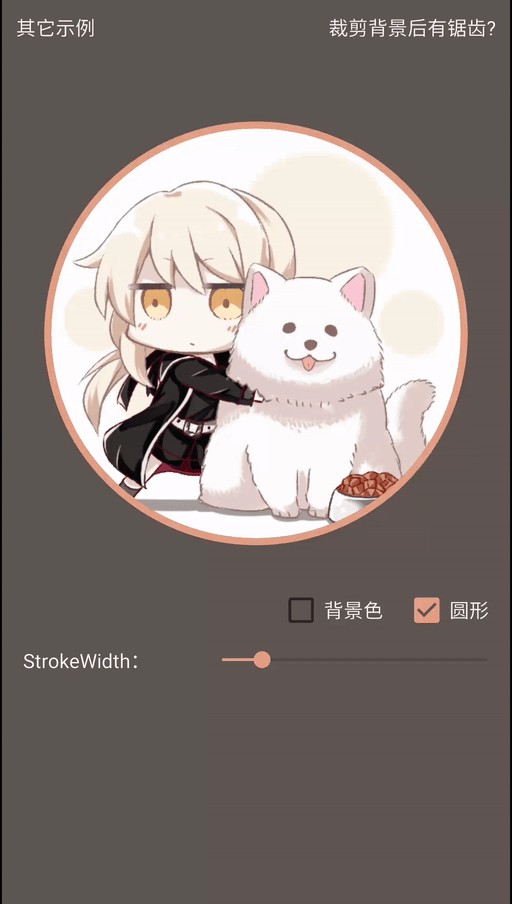
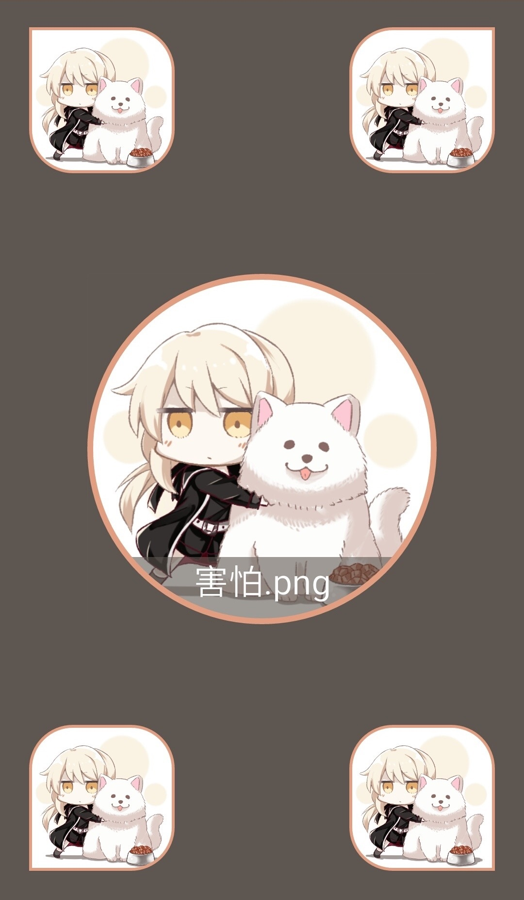
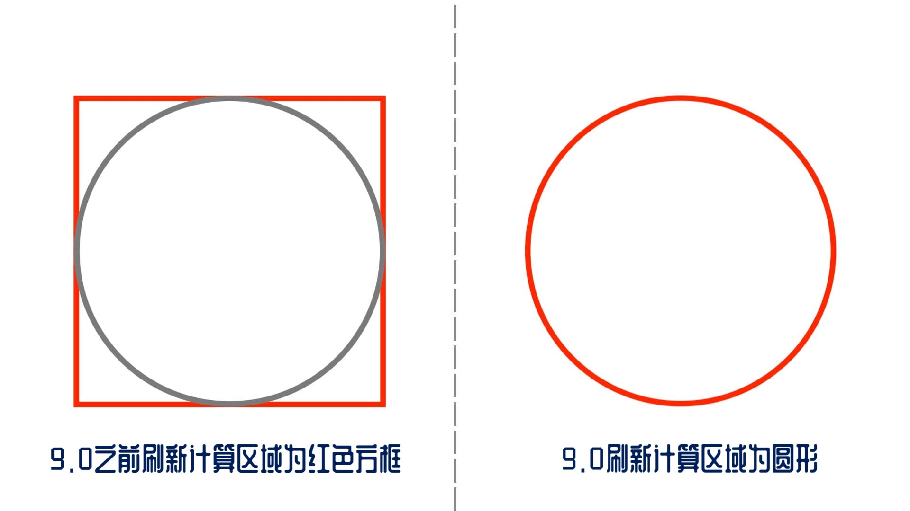

本项目由[GcsSloop](https://github.com/GcsSloop/rclayout)开发, 因为目前原项目停止维护, 但是有部分机型会出现问题, 所以在此个人单独处理, 感谢GcsSloop


# RCLayout(圆角布局)

Android 通用圆角布局，快速实现圆角需求。

之前做项目的时候有圆角相关需求，在网上找了很多方案都不够满意，于是自己做了一个，目前已经使用了一段时间，更新了多个版本，我遇到的问题都进行了修复，并且添加了很多方便的可配置属性，以满足不同需求。

**相关原理解析： [雕虫晓技 · 通用圆角布局全解析](http://www.gcssloop.com/gebug/rclayout)**

## 效果预览

<p>
 
</p>


## 支持的特性

- [x] 包裹任意组件。
- [x] 设置圆角大小。
- [x] 分别对每一个角设置圆角大小。
- [x] 设置描边宽度。
- [x] 设置描边颜色。
- [x] 圆形。
- [x] 支持Padding。
- [x] 圆角抗锯齿。
- [x] 内容可点击区域即为显示区域。
- [x] 是否剪裁自身背景。

## 主要文件

| 名字             | 摘要           |
| ---------------- | -------------- |
| RCRealtiveLayout | 圆角相对布局。 |
| RCImageView      | 圆角图片。     |
| RCHelper         | 圆角辅助工具。 |

### 1. 基本用法

RCRelativeLayout(Round Corner RelativeLayout)，使用圆角布局包裹需要圆角的内容然后添加自定义属性即可

```xml
<com.gcssloop.widget.RCRelativeLayout
    android:padding="20dp"
    android:layout_width="match_parent"
    android:layout_height="match_parent"
    app:round_corner="40dp">

  	<!--任意View-->
    <ImageView
        android:scaleType="centerCrop"
        android:src="@drawable/test"
        android:layout_width="match_parent"
        android:layout_height="match_parent"/>
    <TextView
        android:layout_width="match_parent"
        android:layout_height="50dp"
        android:background="#aaffffff"
        android:gravity="center"
        android:layout_alignParentBottom="true"
        android:text="圆角测试"/>

</com.gcssloop.widget.RCRelativeLayout>
```

### 2. 配置属性

可以在布局文件中配置的基本属性有五个：

| 属性名称                      | 摘要      | 是否必须设置 | 类型      |
| ------------------------- | ------- | ------ | ------- |
| round_corner              | 总体圆角半径  | 否      | dp      |
| round_corner_top_left     | 左上角圆角半径 | 否      | dp      |
| round_corner_top_right    | 右上角圆角半径 | 否      | dp      |
| round_corner_bottom_left  | 左下角圆角半径 | 否      | dp      |
| round_corner_bottom_right | 右下角圆角半径 | 否      | dp      |
| round_as_circle           | 是否剪裁为圆形 | 否      | boolean |
| stroke_width              | 描边半径    | 否      | dp      |
| stroke_color              | 描边颜色    | 否      | color   |
| clip_background           | 剪裁背景    | 否      | boolean |

### 3. 属性简介

#### 3.1 圆角属性

`round_as_circle` 的权限最高，在默认情况下它的值为false，如果设置这个属性为 true，则会忽略圆角大小的数值，剪裁结果均为圆形。

设置圆角大小的一共有5个属性，一个是全局的圆角大小`round_corner`，其余四个`round_corner_xx_xx`是分别对每一个角进行设置，它们之间存在替代关系。

1. 仅设置全局，所有的角都跟随全局。
2. 仅对某些角设置，则只有设置过的角会有圆角效果。
3. 全局和部分都有设置，则有具体设置的角跟随具体设置的数值，没有具体设置的角跟随全局设置。

#### 3.2 描边属性

描边宽度`stroke_width`默认情况下数值为 0，即不存在描边效果。  
描边高度`stroke_color`默认情况下为白色，允许自定义颜色。

#### 3.3 背景剪裁

RCLayout 默认对自身背景剪裁，但是可以通过设置 clip_background 为 false 让RCLayout 不剪裁自身的背景。

### FAQ

> #### Android P (9.0) 圆角失效问题
>
> 这个问题是 Android 系统优化导致，在之前绘制一个 Path 的时候是根据 Path Bounds 区域进行绘制，对于超出实际区域的部分会填充透明像素，而优化后是根据 Path 实际区域进行绘制的，对于超出实际区域的部分不再进行计算。
>
> 例如：绘制一个Path，其中包含一个圆形，在 9.0 之前，它的刷新计算区域为红框包括的区域，在 9.0 之后则直接是一个圆形。
>
> 
>
> **这种优化就间接的导致了使用 Path 时部分 Xfermode 效果与之前不同。**

### 4.添加方法

#### 4.1 添加仓库

在项目的 `build.gradle` 文件中配置仓库地址。

```groovy
	allprojects {
		repositories {
			...
			maven { url 'https://jitpack.io' }
		}
	}
```

#### 4.2 添加项目依赖

在需要添加依赖的 Module 下添加以下信息，使用方式和普通的远程仓库一样。

```groovy
implementation 'com.github.Corey-Jia:RCLayout:1.0.4'
```

### 5.版本说明
1.0.4   修复部分机型开启背景剪裁导致内部view消失问题